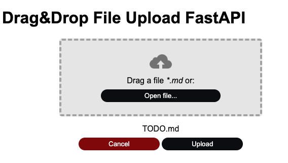

Monday 2024.01.15 14:32:29

**Drag&Drop File Upload FastAPI**
=================================

Fully functional drag&drop a .md file to a div or browse the file system and upload it
 to the backend (with FastAPI).

Usage:
```sh
$ python3 -m venv .venv
$ source .venv/bin/activate
$ pip install -r requirements.txt
$ pip install -r requirements-dev.txt
# Launch the server:
$ uvicorn main:app --reload
```
And with Chrome open: http://127.0.0.1:8000.


